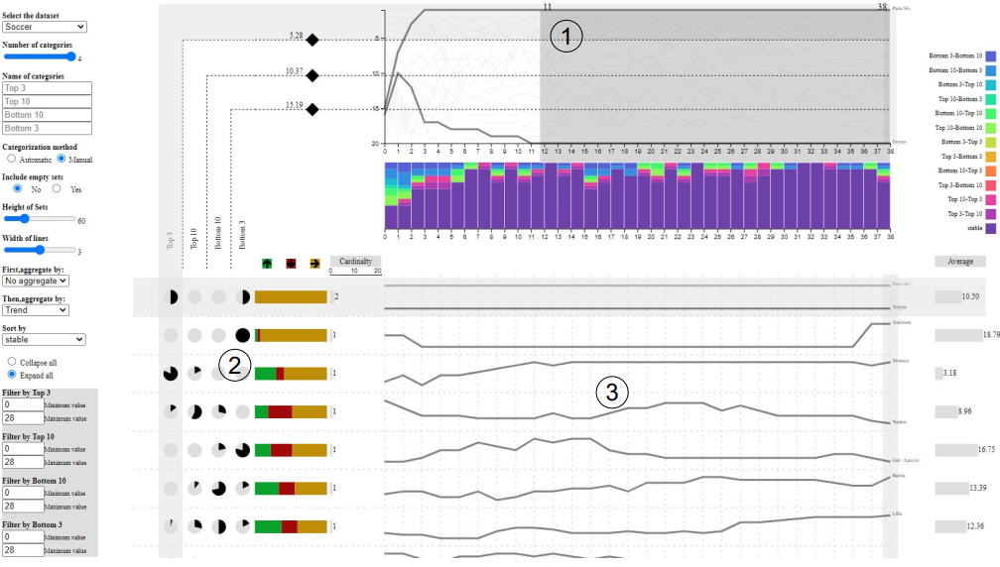
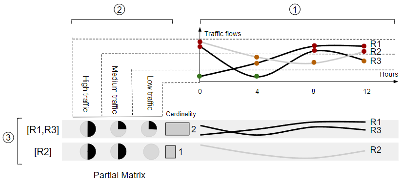

# GroupSet

## About
GroupSet is an interactive and web-based technique to facilitate the exploration of temporal charts. In particular, GroupSet relies on partial sets membership visualization to help users explore how quantitative values change over time. As shown in the following figure, we implemented a soccer team ranking data in GroupSet. In ①, teams are categorized by rank into 4 sets (Top 5, Top 10, Bottom 10, and Bottom 5). Users can then explore the teams based on their memberships to those sets over a season and identify temporal patterns by manipulating a combination matrix of set intersections ②. The final view provided by GROUPSET is a filtered line chart corresponding to each set’s intersection showing teams with similar patterns ③ along with other attributes (e. g., change).


## Concept
As shown in the following figure, sets (Low traffic, Medium traffic, High traffic) are created from time-varying data (line chart) in ①. The same sets are organized as columns to indicate partial membership as pie charts in ② and set intersections are listed as rows to represent groups of similar lines (along with their partial membership representation) in ③.


## Demo
We release a demo with multiple datasets as instance of GroupSet at https://llqsee.github.io/groupset/.

## Video
We introduce what GroupSet can do and how GroupSet helps users explore temporal changes with a video at https://drive.google.com/file/d/1VL0wGmmFFe6mzHbN3gU4vzZBgpuBVbft/view?usp=sharing.

## Datasets

### [index.json](https://github.com/llqsee/groupset/blob/main/index.json) file
This [index.json](https://github.com/llqsee/groupset/blob/main/index.json) file contains all the data lists saved in the [data directory](https://github.com/llqsee/groupset/tree/main/data), shown as follows:

```
[
    "soccer/soccer.json",
    "traffic/traffic.json",
    "random/random.json",
    "mnist/mnist.json",
    "grade/grade.json",
    "gdp/gdp.json",
    "university/university.json",
    "universitySmall/universitySmall.json",
    "soccerCumulative/soccerCumulative.json",
    "soccerSeasons/soccerSeason.json",
    "soccerRepeatTeam/soccer.json",
    "soccerRank/soccerRank.json"
]
```


In each data directory, it basically contains two files that are data.json file and data.csv file:

- data.json file contains the attributes of the data;
- data.csv file contains the raw data.

### data.csv
data.csv file uses (,) as the separator. The rows represent the data items and the columns represent the time-varying values and other attributes. Such as the example of [soccer team rankings](https://github.com/llqsee/groupset/blob/main/data/soccer/soccer.csv), where the soccer games from 0 to 38 are the time-varying values. 

### data.json
data.json file is stored in each data directory and it contains all the attributes and properties of each data.csv file, shown as follows:

```
{
  "file": "soccer/soccer.csv",
  "name": "Soccer",
  "rank": "yes",
  "config": [
    {
      "n": 2,
      "category": [
        {
          "edgeMin": 0,
          "edgeMax": 5,
          "name": "Top 5"
        },
        {
          "edgeMin": 5,
          "edgeMax": 20,
          "name": "Others"
        }
      ]
    }
      ]
    }
  ],
  "id": "Team",
  "temporalAttributes": [],
  "attributes": [
    {
      "name": "Area",
      "type": "quantitative"
    },
    {
      "name": "Population",
      "type": "quantitative"
    }
  ],
  "author": "Romain Vuillemot",
  "source": "https://bl.ocks.org/romsson/8a880f9ae280dafce01956405a7e748d  && https://datahub.io/sports-data/french-ligue-1  && https://www.football-data.co.uk/notes.txt"
}
```

- _File_ describe where is the data.csv file;
- _Name_ describes the name of the file;
- _Rank_ express if the data is ranking;
- _Config_ contains the default categories and the number of the categories. In this example, it contains one classification that includes two categories naming _Top 5_ and _Others_;
- _Id_ refers to the unique id of each data item;
- _TemporalAttributes_ describes the time-varying dimension values, such as the games in soccer teams and hours in traffic flow data; 
- _Attributes_ describes other attributes except for _temporalAttributes_;
- _Author _ describes the author of this data file;
- _Source_ refers to where we get the data.

## Local Deployment
1. Clone the repository.
2. Launch the server with the following code in the project directory.
```
npm install
npm run server
```
3. Open the app at http://localhost:3000/ with your browser (It is better with Chrome).

## How to use your own dataset

We provide two methods to load your own datasets. Method 1 should be the local deployment and method 2 is directly use our [website app](https://llqsee.github.io/groupset/)

### Method 1 - when you deploy it locally
1. Create a folder in [data directory](https://github.com/llqsee/groupset/tree/main/data) on your local side;
2. Put data.json and data.csv into your folder;
3. Update the [index.json](https://github.com/llqsee/groupset/blob/main/index.json) with your own data folder directory.

### Method 2 - when you use the [website app](https://llqsee.github.io/groupset/)

1. Make your data.csv file public (Using dropbox, your own file server, etc). I created a file server with Node.js on Heroku platform. 
2. Change _file_ attribute in your data.json file. The file should be a public link of your data.csv, shown as follows:
```
{
  "file": "https://file-server-liqun.herokuapp.com/files/soccers/soccers.csv",
  "name": "Soccer",
  "rank": "yes",
  "config": [
```
3. Load your data.json file by clicking the button **Load your own data (.json)**. 

## Cite
Liqun Liu, and Romain Vuillemot. "GroupSet: A Set-Based Technique to Explore Time-Varying Dat." EuroVis (Short Papers). 2022.
